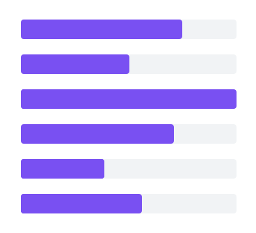
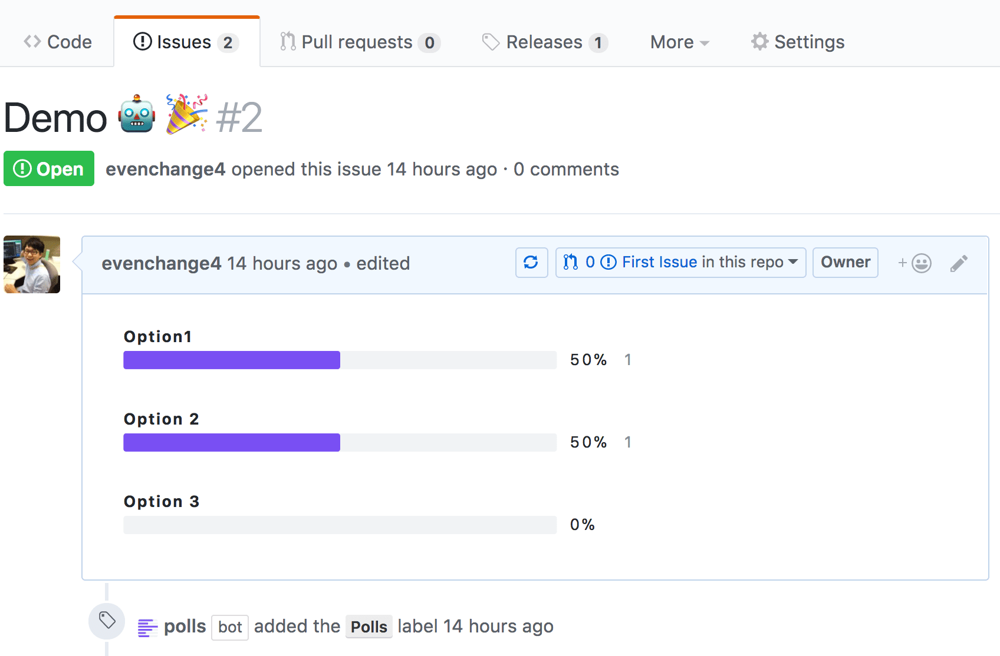
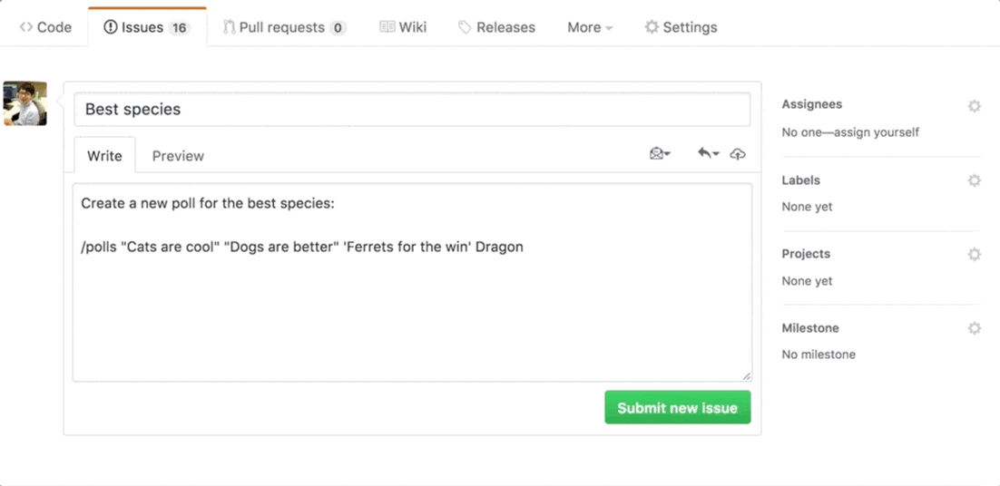

<p align="center" >
  <a href="https://github.com/apps/polls">
    
  </a>
</p>

# GitHub Polls Actions Bot

> A GitHub ~App built with [Probot](https://github.com/probot/probot)~ Action that automatically creates [gh-polls](https://github.com/apex/gh-polls) in GitHub issues.

## 🧪 Experimental 🧪 

Thanks to [`probot/actions-adapter`](https://github.com/probot/actions-adapter), [this cool GitHub Polls Bot project](https://github.com/evenchange4/gh-polls-bot) can now be used as a GitHub Action! 🤩

## Usage

#### Example workflow

```yaml
name: GitHub Polls Actions Bot

on:
  issue_comment:
    types: [created, edited] # issue comment is created or edited
  issues:
    types: [opened, edited] # issue is opened or edited

jobs:
  polls:
    runs-on: ubuntu-latest
    steps:
    - uses: imjohnbo/gh-polls-bot-action@master
      env:
        GITHUB_TOKEN: ${{ secrets.GITHUB_TOKEN }} # created for you automatically; https://help.github.com/en/github/automating-your-workflow-with-github-actions/virtual-environments-for-github-actions#github_token-secret
```

#### Command in issue body or comment

```md
/polls Option1 'Option 2' "Option 3"

# Automatically replace with the following markdown =>
[](https://api.gh-polls.com/poll/01BY7ECS60GG8F9AR1VMR8745S/Option1/vote)
[](https://api.gh-polls.com/poll/01BY7ECS60GG8F9AR1VMR8745S/Option%202/vote)
[](https://api.gh-polls.com/poll/01BY7ECS60GG8F9AR1VMR8745S/Option%203/vote)
```

| **Screenshot** | [](https://github.com/evenchange4/gh-polls-bot/issues/2)  |
| -------------- | -------- |
| **Demo** |  |


## Inspiration

- https://github.com/probot/commands
- https://github.com/srph/gh-polls-web

## CONTRIBUTING

*   ⇄ Pull requests and ★ Stars are always welcome.
*   For bugs and feature requests, please create an issue.
*   Pull requests must be accompanied by passing automated tests (`$ yarn run test`).

## [CHANGELOG](CHANGELOG.md)

## [LICENSE](LICENSE)

[MIT](LICENSE)
